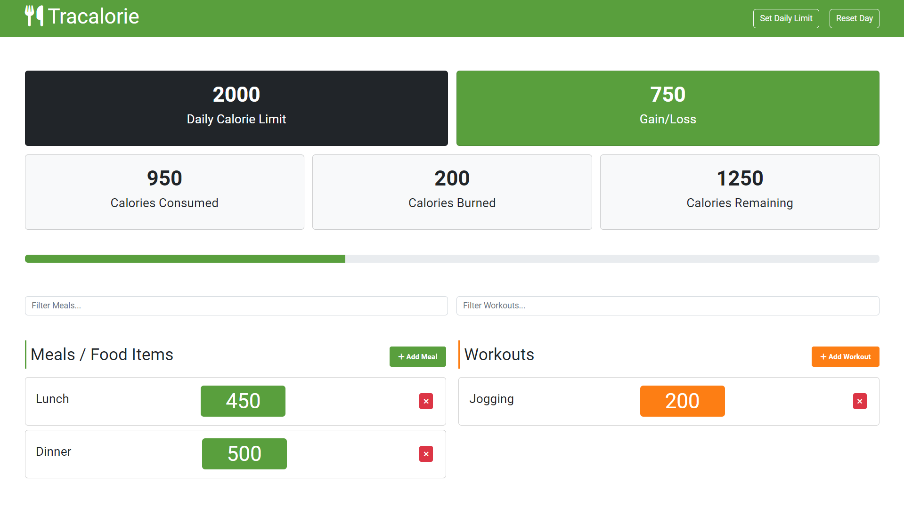

## Calorie Tracker Web Application

### Description

This repository houses a user-friendly Calorie Tracker web application developed using Vanilla JavaScript. The app allows users to keep track of their daily calorie consumption and workouts, assisting them in reaching their fitness goals effectively. It serves as an excellent tool to manage your calorie intake and monitor your progress towards a healthier lifestyle. Project created during Brad Traversy course.

### Demo:

Check it out live: [Tracalorie App](https://sprightly-fenglisu-27d9e4.netlify.app)

### Key Features:

- **Adding meals and workouts:** With this application, you can easily input the name and calorie count of the meals you consume and the workouts you engage in. The app will automatically update the total calorie count based on your entries.

- **Removing meals and workouts:** If you wish to remove any previously added meals or workouts, simply click on the "Remove" button next to the item, and it will be promptly removed from the tracker.

- **Setting the calorie limit:** Users have the flexibility to set their daily calorie limit. The application will calculate and display the remaining calories, helping you stay on track with your dietary goals.

- **Filtering items:** For easy organization and quick access, the app allows you to search and filter through the added meals and workouts using the provided filter input fields.

- **Local Storage Integration:** _(v2)_ The application now incorporates local storage functionality, ensuring that your tracked data persists even after closing the browser or refreshing the page. This enhancement provides a more seamless experience and prevents data loss.

- **Webpack Integration:** _(v3)_ Webpack was integrated into the project to optimize its performance and loading times. By bundling and minifying JavaScript, CSS, and other assets, the overall file sizes were reduced, leading to faster loading times for users. Additionally, Webpack allowed the utilization of the latest ECMAScript modules (ES modules) syntax, enabling better code organization and modularity.